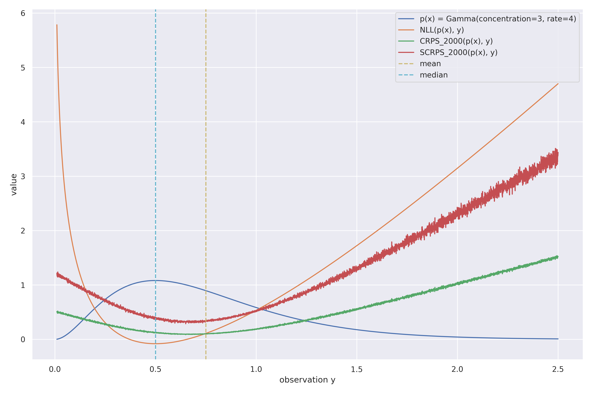
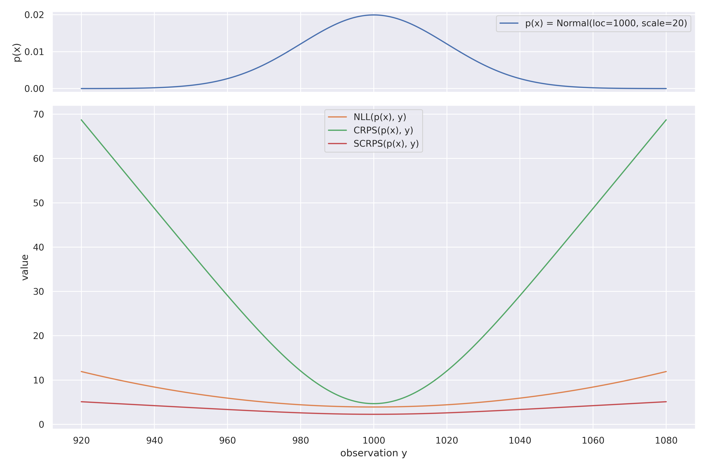

# torch-crps

[![License: BSD-3-Clause][license-badge]][license-url]
![python][python-badge]<space>
[![Docs][docs-badge]][docs]
[![CD][cd-badge]][cd]
[![Coverage][coverage-badge]][coverage]
[![Tests][tests-badge]][tests]
[![mkdocs-material][mkdocs-material-badge]][mkdocs-material]
[![mypy][mypy-badge]][mypy]
[![pre-commit][pre-commit-badge]][pre-commit]
[![pytest][pytest-badge]][pytest]
[![Ruff][ruff-badge]][ruff]
[![uv][uv-badge]][uv]

PyTorch-based implementations of the Continuously-Ranked Probability Score (CRPS) as well as its locally scale-invariant
version (SCRPS)

## Background

### Continuously-Ranked Probability Score (CRPS)

The CRPS is a strictly proper scoring rule.
It assesses how well a distribution with the cumulative distribution function $F(X)$ of the estimate $X$ (a random
variable) is explaining an observation $y$

$$
\text{CRPS}(F,y) = \int _{\mathbb {R}} \left( F(x)-\mathbb {1} (x\geq y) \right)^{2} dx
$$

where $1$ denoted the indicator function.

In Section 2 of this [paper][crps-folumations] Zamo & Naveau list 3 different formulations of the CRPS. One of them is

$$
\text{CRPS}(F, y) = E[|X - y|] - 0.5 E[|X - X'|] = E[|X - y|] + E[X] - 2 E[X F(X)]
$$

which can be shortened to

$$
\text{CRPS}(F, y) = A - 0.5 D
$$

where $A$ is called the accuracy term and $D$ is called the disperion term (at least I do it in this repo).

### Scaled Continuously-Ranked Probability Score (SCRPS)

The SCRPS is a locally scale-invariant version of the CRPS.
In their [paper][scrps-paper], Bolling & Wallin define it in a positively-oriented, i.e., higher is better.
In contrast, I implement the SCRPS in this repo negatively-oriented, just like a loss function.

Oversimplifying the notation, the (negatively-oriented) SCRPS can be written as

$$
\text{SCRPS}(F, y) = -\frac{E[|X - y|]}{E[|X - X'|]} - 0.5 \log \left( E[|X - X'|] \right)
$$

which can be shortened to

$$
\text{SCRPS}(F, y) = \frac{A}{D} + 0.5 \log(D)
$$

The scale-invariance, i.e., the SCRPS value does not depend on the magnitude of $D$, comes from the division by $D$.

Note that the SCRPS can, in contrast to the CRPS, yield negative values.

### Visualization

<table>
  <tr>
    <td></td>
    <td></td>
  </tr>
</table>

The left figure shows the NLL, CRPS, and SCRPS evaluated on a grid for a Gamma distribution.
Since there is no closed-form solution for the Gamma distribution (in this or any other package I know), the CRPS and
SCRPS values have been estimated from 2000 samples.

The figure on the right show how the NLL and CRPS depend on the scale of the problem, while the SCRPS does not.
Since there is a closed-form solutions for the Normal distribution, all scores are exact for this example.

### Incomplete list of sources that I came across while researching about the CRPS

- Hersbach, "Decomposition of the Continuous Ranked Probability Score for Ensemble Prediction Systems"; 2000
- Gneiting et al.; "Calibrated Probabilistic Forecasting Using Ensemble Model Output Statistis and Minimum CRPS Estimation"; 2004
- Gneiting & Raftery; "Strictly Proper Scoring Rules, Prediction, and Estimation"; 2007
- Zamo & Naveau; "Estimation of the Continuous Ranked Probability Score with Limited Information and Applications to Ensemble Weather Forecasts"; 2018
- Jordan et al.; "Evaluating Probabilistic Forecasts with scoringRules"; 2019
- Bollin & Wallin; "Local scale invariance and robustness of proper scoring rules"; 2029
- Olivares & Négiar & Ma et al; "CLOVER: Probabilistic Forecasting with Coherent Learning Objective Reparameterization"; 2023
- Vermorel & Tikhonov; "Continuously-Ranked Probability Score (CRPS)" [blog post][Lokad-post]; 2024
- Nvidia; "PhysicsNeMo Framework" [source code][nvidia-crps-implementation]; 2025
- Zheng & Sun; "MVG-CRPS: A Robust Loss Function for Multivariate Probabilistic Forecasting"; 2025

## Application to Machine Learning

The CRPS, as well as the SCRPS, can be used as a loss function in machine learning, just like the well-known negative
log-likelihood loss which is the log scoring rule.

The parametrized model outputs a distribution $q(x)$. The CRPS loss evaluates how good $q(x)$ is explaining the
observation $y$.
This is a distribution-to-point evaluation, which fits well for machine learning as the ground truth $y$ almost always
comes as fixed values.

For processes over time and/or space, we need to estimate the CRPS for every point in time/space separately.

There is [work on multi-variate CRPS estimation][multivariate-crps], but it is not part of this repo.

## Implementation

The direct implementation of the integral formulation is not suited to evaluate on a computer due to the infinite
integration over the domain of the random variable $X$.
Nevertheless, this repository includes such an implementation to verify the others.

The normalization-by-observation variants are improper solutions to normalize the CPRS values. The goal is to use the
CPRS as a loss function in machine learning tasks. For that, it is highly beneficial if the loss does not depend on
the scale of the problem.
However, deviding by the absolute maximum of the observations is a bad proxy for doing this.
I plan on removing these methods once I gained trust in my SCRPS implementation.

I found [Nvidia's implementation][nvidia-crps-implementation] of the CRPS for ensemble preductions in $M log(M)$ time
inspiring to read.

:point_right: **Please have a look at the [documentation][docs] to get started.**

<!-- URLs -->
[cd-badge]: https://github.com/famura/torch-crps/actions/workflows/cd.yaml/badge.svg
[cd]: https://github.com/famura/torch-crps/actions/workflows/cd.yaml
[ci-badge]: https://github.com/famura/torch-crps/actions/workflows/ci.yaml/badge.svg
[ci]: https://github.com/famura/torch-crps/actions/workflows/ci.yaml
[coverage-badge]: https://famura.github.io/torch-crps/latest/exported/coverage/badge.svg
[coverage]: https://famura.github.io/torch-crps/latest/exported/coverage/index.html
[docs-badge]: https://img.shields.io/badge/Docs-gh--pages-informational
[docs]: https://famura.github.io/torch-crps
[license-badge]: https://img.shields.io/badge/license-BSD--3--Clause-blue.svg
[license-url]: https://opensource.org/license/bsd-3-clause
[mkdocs-material-badge]: https://img.shields.io/badge/Material_for_MkDocs-526CFE?logo=MaterialForMkDocs&logoColor=white
[mkdocs-material]: https://github.com/squidfunk/mkdocs-material
[mypy-badge]: https://www.mypy-lang.org/static/mypy_badge.svg
[mypy]: https://github.com/python/mypy
[pre-commit-badge]: https://img.shields.io/badge/pre--commit-enabled-brightgreen?logo=pre-commit&logoColor=white
[pre-commit]: https://github.com/pre-commit/pre-commit
[pytest-badge]: https://img.shields.io/badge/Pytest-green?logo=pytest
[pytest]: https://github.com/pytest-dev/pytest
[python-badge]: https://img.shields.io/badge/python-3.11%20|3.12%20|%203.13-informational?logo=python&logoColor=ffdd54
[ruff-badge]: https://img.shields.io/endpoint?url=https://raw.githubusercontent.com/astral-sh/ruff/main/assets/badge/v2.json
[ruff]: https://docs.astral.sh/ruff
[tests-badge]: https://famura.github.io/torch-crps/latest/exported/tests/badge.svg
[tests]: https://famura.github.io/torch-crps/latest/exported/tests/index.html
[uv-badge]: https://img.shields.io/endpoint?url=https://raw.githubusercontent.com/astral-sh/uv/main/assets/badge/v0.json
[uv]: https://docs.astral.sh/uv
<!-- Paper URLS-->
[crps-folumations]: https://link.springer.com/article/10.1007/s11004-017-9709-7
[scrps-paper]: https://arxiv.org/abs/1912.05642
[Lokad-post]: https://www.lokad.com/continuous-ranked-probability-score/
[multivariate-crps]: https://arxiv.org/pdf/2410.09133
[nvidia-crps-implementation]: https://docs.nvidia.com/physicsnemo/25.11/_modules/physicsnemo/metrics/general/crps.html
